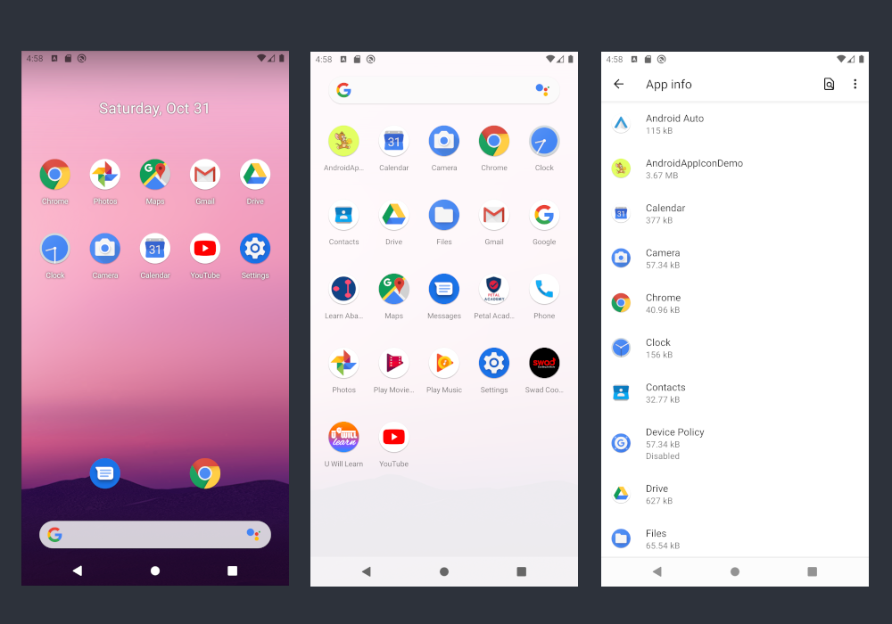

summary: Learn how to manage launcher icons for your app
id: android-launcher-icons
categories: Android
tags: android
status: Published
authors: Harshal Bhakta
Feedback Link: https://harshalbhakta.com

# Android Launcher Icons

<!-- ------------------------ -->
## Overview
Duration: 1

### What is a launcher icon?

Launcher icons are icons that uniquely represent apps on various screens like home screen, launcher screen and settings screen. It is important for you to understand how to correctly manage the launcher icons for your app.



### Adaptive Launcher Icons

Google added support for adaptive launcher icons in Android 8.0 (API level 26). Adaptive launcher icons allow launcher icons to be displayed in a variety of shapes accross different device models. For example, Samsung might show circular icons (1st in the below image) for all apps on one of their devices, while Motorola might want to show a completely different shape (last in the below image).

Device manufacturers opt for different icon shapes and animations to be used on their devices. Adaptive Icons allow you to define a single icon that can be converted to any shape required by the OEM device.


Adaptive icons are actually made up of two layers. In this codelab, we will be discussing how to add both the layers in an Android project.

#### Foreground Layer (Top)
* 108dp*108dp
* May include transparency

#### Background Layer (Bottom)
* 108dp*108dp
* Must be fully opaque


To learn more about Adaptive Icons, refer to below two links.

* [https://developer.android.com/guide/practices/ui_guidelines/icon_design_adaptive](https://developer.android.com/guide/practices/ui_guidelines/icon_design_adaptive)
* [https://medium.com/google-design/designing-adaptive-icons-515af294c783](https://medium.com/google-design/designing-adaptive-icons-515af294c783)

### What You’ll Learn
- How to support Adaptive Launcher Icons in your Android project?
- Image sizes required for Foreground and Background layers
- Which folders and files are used to support Adaptive Launcher Icons?

<!-- ------------------------ -->
## Getting Started
Duration: 2

We will be creating a new Android project and add new Launcher Icons to it.

<!-- ------------------------ -->
### What will you need?

- Android Studio 4.1
- Icon images

### Create new project

Choose "Create New Project" on the welcome screen of Android Studio 4.1


Select "Empty Activity"  option from the "Select a Project Template" screen


Enter "AndroidLauncherIconDemo" as the name of the app and click "Finish"


### Commit the code using Git

It's always good to commit the code generated by Android Studio. This lets you keep track of the changes you make.

````bash
$ git init
$ git add --all
$ git commit -m "Created a new project using Android Studio 4.1 -> Empty Activity"
````

### Download the Icon Images

You can right-click on the below links and click Save As to download the files.

#### Foreground Image

* [Download](/codelabs/android-launcher-icons/img/ba746d47d260f0e3.png)

#### Background Image

* [Download](/codelabs/android-launcher-icons/img/318e46551a12999d.png)

<!-- ------------------------ -->
## Existing Icon Files

Let's look at the default icon files generated by Android Studio 4.1. You can [browse] (https://github.com/FullstackCodelabs/AndroidLauncherIconDemo/tree/15873f20a1b35d143cd2e0fea17b0bbaae8ffdd1) or [download the zip](https://github.com/FullstackCodelabs/AndroidLauncherIconDemo/archive/15873f20a1b35d143cd2e0fea17b0bbaae8ffdd1.zip) for the source code of the default project generated by Android Studio.

### AndroidManifest.xml

By default, there are two icons defined in the `application` tag. Both use resources from the [mipmap](https://developer.android.com/training/multiscreen/screendensities#mipmap) folder. `mipmap` directory is specifically used to store app icons. All other images are stored in the `drawable-*` folder.

````xml
<manifest>
    <application
        ...
        android:icon="@mipmap/ic_launcher"
        android:roundIcon="@mipmap/ic_launcher_round"
        ...>
    </application>
</manifest>
````

### mipmap folder

* mipmap folder has `ic_launcher.png` & `ic_launcher_round.png` files in all density folders (mipmap-hdpi, mipmap-mdpi, mipmap-xhdpi, mipmap-xxhdpi & mipmap-xxxhdpi). Used for <b>API level < 26</b>.
* mipmap folder has `ic_launcher.xml` & `ic_launcher_round.xml` files in the mipmap-anydpi-v26 folder. Used for <b>API >= 26</b>.


#### mipmap-hdpi to mipmap-xxxhdpi

<b>ic_launcher.png</b> - To be used on API level < 26 devices where non-circular launcher icon is required.


<b>ic_launcher_round.png</b> - To be used on API level < 26 devices where circular launcher icon is required.


<b>File Sizes</b> - Below are the exact sizes of the icons generated by Android Studio

| Folder        | File                                    | Size    |
| ------------- |:---------------------------------------:| -------:|
| mipmap-mdpi   | ic_launcher.png / ic_launcher_round.png | 48x48   |
| mipmap-hdpi   | ic_launcher.png / ic_launcher_round.png | 72x72   |
| mipmap-xhdpi  | ic_launcher.png / ic_launcher_round.png | 96x96   |
| mipmap-xxhdpi | ic_launcher.png / ic_launcher_round.png | 144x144 |
| mipmap-xxxhdpi| ic_launcher.png / ic_launcher_round.png | 192x192 |

#### mipmap-anydpi-v26

Both `ic_launcher.xml` and `ic_launcher_round.xml` use `ic_launcher_background` and `ic_launcher_foreground` from `drawable` folder.

<b>ic_launcher.xml</b> - To be used on API level > 26 devices where non-circular launcher icon is required.

````xml
<?xml version="1.0" encoding="utf-8"?>
<adaptive-icon xmlns:android="http://schemas.android.com/apk/res/android">
    <background android:drawable="@drawable/ic_launcher_background" />
    <foreground android:drawable="@drawable/ic_launcher_foreground" />
</adaptive-icon>
````

<b>ic_launcher_round.xml</b> - To be used on API level > 26 devices where non-circular launcher icon is required.

````xml
<?xml version="1.0" encoding="utf-8"?>
<adaptive-icon xmlns:android="http://schemas.android.com/apk/res/android">
    <background android:drawable="@drawable/ic_launcher_background" />
    <foreground android:drawable="@drawable/ic_launcher_foreground" />
</adaptive-icon>
````

### drawable folder

There are 2 files related to launcher icons in the drawable folder. `ic_launcher_background.xml` in the `drawable` folder. `ic_launcher_foreground.xml` in the `drawable-v24` folder. `ic_launcher_foreground.xml` is placed in the `drawable-v24` folder since `android:fillColor` in that file uses `gradient` which is [only supported on SDK 24+](https://developer.android.com/reference/kotlin/android/graphics/drawable/VectorDrawable)

<aside class="warning">
  <p><strong>Note:</strong> Since `ic_launcher_background.xml` and `ic_launcher_foreground.xml` are only referenced from `mipmap-anydpi-v26`, we can move these files to the `drawable-anydpi-v26` for consistency. We will discuss this in the upcoming sections of the codelab.</p>
</aside>


#### ic_launcher_foreground.xml

Holds the vector definition for the image to be used as the foreground of the adaptive launcher icon


#### ic_launcher_background.xml

Holds the vector definition for the image to be used as the background of the adaptive launcher icon


<!-- ------------------------ -->
## Remove existing icons
Duration: 2

Switch to the Android view and select all the icons files, right-click and click on Delete.


Click on "Delete Anyway" when Android Studio warns that the files are used in the project.


Below are the files you need to delete.


<!-- ------------------------ -->
## Add new icon
Duration: 2

We will add the new icon to the project using Image Asset Studio.

### Generate new icon using Image Asset Studio

To start, right-click on the `res` folder and click on New -> Image Asset


You will now see the Configure Image Asset dialog


Click on the folder icon for the Path in the Foreground Layer and choose the foreground image


Adjust the Scaling -> Resize slider so that the logo fits perfectly withing the safe zone lines shown in the preview images


Click on the folder icon for the Path in the Background Layer and choose the background image


You can also update other icon related settings from the Options tab. For this codelab, we will leave them to their default values.


Clicking on Next will take you to the Confirm Icon Path screen. You can check preview of each icon file that will be generated. Click on Finish to proceed.


Run the app and you can see the new icon on the home screen.


You can also check how the icon will look in different shapes using this [utility](https://github.com/nickbutcher/AdaptiveIconPlayground/releases).


<!-- ------------------------ -->
## New Icon files

Let's take a look at the files generated by Android Studio to support Adaptive and Legacy launcher icons. Below are the files created by Android Studio when we generated launcher icons using Image Asset Studio.


### How are these files used?

AndroidManifest.xml references `ic_launcher` and `ic_launcher_round` from mipmap folder as launcher icons.

````xml
<manifest>
    <application
        android:icon="@mipmap/ic_launcher"
        android:roundIcon="@mipmap/ic_launcher_round">
    </application>
</manifest>
````

Android Studio generated files to support 2 types of launcher icons.

#### 1.  Adaptive Launcher Icons (API Level >= 26 - Android 8 and above)

Devices running API level greater than or equal to 26 support adaptive icons. Adaptive icons need separate images for foreground and background layer. Both layers are defined in the `ic_launcher.xml` and `ic_launcher_round.xml` file in `mipmap-anydpi-v26` folder.

<b>mipmap-anydpi-v26/ic_launcher.xml & mipmap-anydpi-v26/ic_launcher_round.xml (Both have the same content)</b>

````xml
<?xml version="1.0" encoding="utf-8"?>
<adaptive-icon xmlns:android="http://schemas.android.com/apk/res/android">
    <background android:drawable="@mipmap/ic_launcher_background"/>
    <foreground android:drawable="@mipmap/ic_launcher_foreground"/>
</adaptive-icon>
````

Both the xml files reference `ic_launcher_background` and `ic_launcher_foreground` from `mipmap` folder. `ic_launcher_background.png` and `ic_launcher_foreground.png` are used for background and foreground layer of the adaptive icons from device specific density folder - (m|h|xh|xxh|xxxh)dpi.

* ic_launcher_foreground.png - To be used in the foreground layer of the adaptive icons
* ic_launcher_background.png - To be used in the background layer of the adaptive icons

#### 2. Legacy Launcher Icons (API Level < 26)

Devices running API level less than 26 don't support adaptive icons. To devices that use circular launcher icons, a separate `ic_launcher_round.png` is generated. For all other devices, `ic_launcher.png` is used.

* ic_launcher.png - For devices that uses non-circular launcher icons
* ic_launcher_round.png - For devices that uses circular launcher icons

AndroidManifest.xml uses `ic_launcher` and `ic_launcher_round` from mipmap folder as launcher icons. For API level < 26, ic_launcher.png and ic_launcher_round.png are directly used as launcher icons from device specific density folder - (m|h|xh|xxh|xxxh)dpi.

### File Sizes (px)

Below are the exact sizes of the images generated by Android Studio. If you want to replace the launcher icon files manually, you can refer to these sizes for reference.

| Folder            | ic_launcher_background.png <br> ic_launcher_foreground.png | ic_launcher.png <br> ic_launcher_round.png |
| ----------------- |:----------------------------------------------------------:| ------------------------------------------:|
| mipmap-mdpi       | 108x108                                                    | 48x48                                      |
| mipmap-hdpi       | 162x162                                                    | 72x72                                      |
| mipmap-xhdpi      | 216x216                                                    | 96x96                                      |
| mipmap-xxhdpi     | 324x324                                                    | 144x144                                    |
| mipmap-xxxhdpi    | 432x432                                                    | 192x192                                    |

<!-- ------------------------ -->
## (Alternate Option) - Using color for background layers

In the earlier section we used ic_launcher_background.png file for generating the launcher icons using Image Asset Studio. Instead of an image file, its also possible to use a background color.

To do this, swith the Asset Type to 'Color' while generating launcher icon using Asset Studio.


Below files will be generated for launcher icons.


`ic_launcher_background.xml` will be generated in the `app/src/main/res/values/` folder instead of `ic_launcher_background.png` in all `mipmap` density folders.

````xml
<?xml version="1.0" encoding="utf-8"?>
<resources>
    <color name="ic_launcher_background">#DD5E6A</color>
</resources>
````

Run the app and you can see the new icon on the home screen. The resulting launcher icon will be similar to the one generated using image file.


<!-- ------------------------ -->
## Summary

### AndroidManifest.xml

````xml
<manifest>
    <application
        android:icon="@mipmap/ic_launcher"
        android:roundIcon="@mipmap/ic_launcher_round">
    </application>
</manifest>
````

### All files for supporting Adaptive and Legacy Launcher Icons

````xml
app/src/main/res/
|
|--- mipmap-anydpi-v26
|   |--- ic_launcher.xml (Adaptive)
|   |--- ic_launcher_round.xml (Adaptive)
|--- mipmap-mdpi
|   |--- ic_launcher.png (Legacy) (48x48)
|   |--- ic_launcher_background.png (Adaptive) (108x108)
|   |--- ic_launcher_foreground.png (Adaptive) (108x108)
|   |--- ic_launcher_round.png (Legacy) (48x48)
|--- mipmap-hdpi
|   |--- ic_launcher.png (Legacy) (72x72)
|   |--- ic_launcher_background.png (Adaptive) (162x162)
|   |--- ic_launcher_foreground.png (Adaptive) (162x162)
|   |--- ic_launcher_round.png (Legacy) (72x72)
|--- mipmap-xhdpi
|   |--- ic_launcher.png (Legacy) (96x96)
|   |--- ic_launcher_background.png (Adaptive) (216x216)
|   |--- ic_launcher_foreground.png (Adaptive) (216x216)
|   |--- ic_launcher_round.png (Legacy) (96x96)
|--- mipmap-xxhdpi
|   |--- ic_launcher.png (Legacy) (144x144)
|   |--- ic_launcher_background.png (Adaptive) (324x324)
|   |--- ic_launcher_foreground.png (Adaptive) (324x324)
|   |--- ic_launcher_round.png (Legacy) (144x144)
|--- mipmap-xxxhdpi
|   |--- ic_launcher.png (Legacy)
|   |--- ic_launcher_background.png (Adaptive) (432x432)
|   |--- ic_launcher_foreground.png (Adaptive) (432x432)
|   |--- ic_launcher_round.png (Legacy) (192x192)
|
````

### ic_launcher.xml & ic_launcher_round.xml

````xml
<?xml version="1.0" encoding="utf-8"?>
<adaptive-icon xmlns:android="http://schemas.android.com/apk/res/android">
    <background android:drawable="@mipmap/ic_launcher_background"/>
    <foreground android:drawable="@mipmap/ic_launcher_foreground"/>
</adaptive-icon>
````

<!-- ------------------------ -->
## References
Duration: 1

### Source code

* [AndroidLauncherIconDemo Github Repo](https://github.com/FullstackCodelabs/AndroidLauncherIconDemo)
* [AndroidLauncherIconDemo Alternate Background Color](https://github.com/FullstackCodelabs/AndroidLauncherIconDemo/tree/background-color)
* [Foreground Icon Image](/codelabs/android-launcher-icons/img/ba746d47d260f0e3.png)
* [Background Icon Image](/codelabs/android-launcher-icons/img/318e46551a12999d.png)

### Learn more

* [Android Developers Guides - Adaptive icons](https://developer.android.com/guide/practices/ui_guidelines/icon_design_adaptive)
* [Android Developers Guides - Image Asset Studio](https://developer.android.com/studio/write/image-asset-studio)
* [Material Design - Android icons](https://material.io/design/platform-guidance/android-icons.html)
* [Google Design - Designing Adaptive Icons](https://medium.com/google-design/designing-adaptive-icons-515af294c783)
* [Android Developers - Implementing Adaptive Icons](https://medium.com/androiddevelopers/implementing-adaptive-icons-1e4d1795470e)
* [AdaptiveIconPlayground](https://github.com/nickbutcher/AdaptiveIconPlayground)